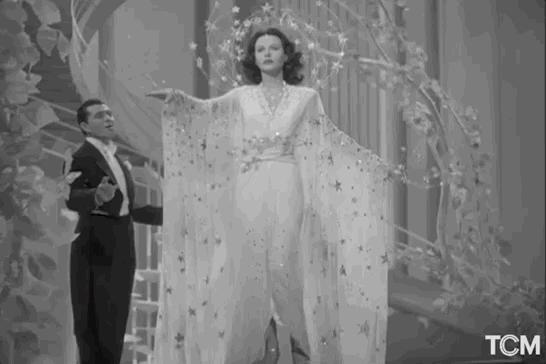

# Proyecto Bombshell

El equipo :
- Project Owner : Violaine Deloustal                                      
- Scrum Master : Raquel Castellanos
- Developer : Patricia González
- Developer : Lidia Fraile
- Developer : Diana García

Se puso en contacto con nosotras la plataforma de streaming BHO, que está en una continua exploración para mejorar la excelencia de su material y la felicidad de sus usuarios.

El proyecto Bombshell consiste en aplicar técnicas de análisis de datos para identificar cuáles son las películas y cortometrajes más populares y mejor valorados desde 2010 hasta la fecha. 

Dividimos el proyecto en 7 fases:

- Fase 1: Extracción de Datos de API de MoviesDataset
- Fase 2: Extracción de Detalles de Películas con Selenium
- Fase 3: Extracción de Detalles de Actores con Selenium
- Fase 4: Extracción de Tablas de los Premios Oscar con Beautiful Soup
- Fase 5: Creación de una Base de Datos
- Fase 6: Inserción de Datos en la Base de Datos
- Fase 7: Realización de Consultas para Obtener Información

Los objetivos principales eran consolidar nuestros conocimientos, tanto en Python como en MySQL, y aprender a gestionar el control de versiones en equipo para resolver conflictos. Nos fuimos turnando a lo largo de todo el proyecto, de forma que cada semana tuvimos una PO y una SCRUM master diferente. Esto nos ha ayudado a mejorar la comunicación entre nosotras y organizarnos más como equipo.

### Uso de herramientas:
Para llevar a cabo este proyecto, usamos todas estas herramientas: 
- MySQL
- Python
- Selenium
- BeautifulSoup
- Api
- Pandas
- Genially
- Canva
- Excel
- Slack
- Zoom

### Conclusiones:
Tuvimos diferentes retos a lo largo del proceso que fuimos solventando en equipo. 
Extrajimos más de 34.000 películas mediante la API.
Sacamos información de más de 16.000 actores que aparecían en esas películas.
Descubrimos los principales premiados en los Óscar desde el 2011 hasta ahora.

